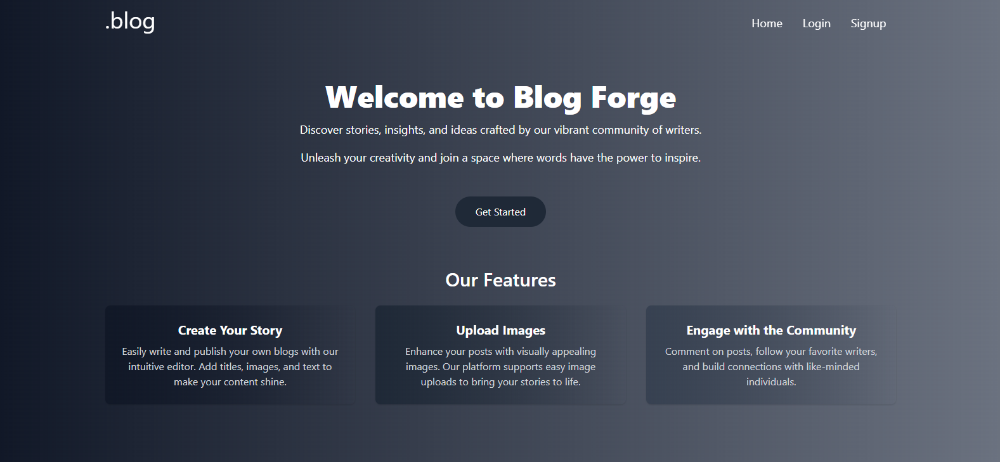

# .blog

## Overview
.blog is a modern web application designed for seamless content creation and blogging. It provides a responsive user interface with rich text editing, user authentication, and a robust content management system.

## Preview



## 🚀 Features

- User authentication and session management
- Rich text editor using TinyMCE
- State management with Redux Toolkit
- Responsive design with Tailwind CSS
- API integration with Appwrite
- SEO-friendly structure

## 🔗 Live Demo

Check out the live version of .blog here: [Live Site](https://blog-alpha-amber-57.vercel.app/)

## 🛠 Installation & Setup

To set up and run the project locally, follow these steps:

### Prerequisites

Ensure you have the following installed:

- **Node.js** (Latest LTS version recommended)
- **npm** or **yarn** for package management
- A **MongoDB database**

### Steps to Run

1. **Clone the repository:**
   ```sh
   git clone https://github.com/Sankalp20Tiwari/blog.git
   ```
2. **Navigate to the project directory:**
   ```sh
   cd blog
   ```
3. **Install dependencies:**
   ```sh
   npm install  # or yarn install
   ```
4. **Configure environment variables:**
   Create a `.env` file in the root directory and define the necessary environment variables:
   ```sh
  VITE_APPWRITE_URL=<your-appwrite-url>
  VITE_APPWRITE_PROJECT_ID=<your-appwrite-project-id> 
  VITE_APPWRITE_DATABASE_ID=<your-appwrite-database-id>
  VITE_APPWRITE_COLLECTION_ID=<your-appwrite-collection-id>
  VITE_APPWRITE_BUCKET_ID=<your-appwrite-bucket-id>
  VITE_TINYMCE_API_KEY=<your-tinymce-api-key>
   ```
5. **Run the development server:**
   ```sh
   npm run dev  # or yarn dev
   ```
6. Open `http://localhost:3000` in your browser to view the application.

## 🔧 Configuration

The application uses environment variables to manage API endpoints and database connections. Update the `.env` file accordingly to ensure smooth functionality.


## 📂 Project Structure
```
blogproject/
│-- src/
    ├── appwrite/     # appwrite config
    ├── components/   # Reusable UI components
    ├── pages/        # Application pages
    ├── store/        # Redux store configuration
    ├── main.jsx
    ├── App.jsx 
│-- public/
│-- .env             # Environment variables
│-- package.json     # Dependencies and scripts
│-- vite.config.js   # Vite configuration
```

## 🏰 Technologies Used
 
- **React** - Frontend library
- **Redux Toolkit** - State management
- **Tailwind CSS** - Styling
- **TinyMCE** - Rich text editor
- **Appwrite** - Backend services
- **Vite** - Development and build tool

## 🤝 Contributing
Contributions are welcome! To contribute:
1. Fork the repository
2. Create a new branch (`feature-new-feature`)
3. Commit your changes (`git commit -m 'Add new feature'`)
4. Push to the branch (`git push origin feature-new-feature`)
5. Open a pull request

## License
This project is licensed under the MIT License. See the LICENSE file for more details.


